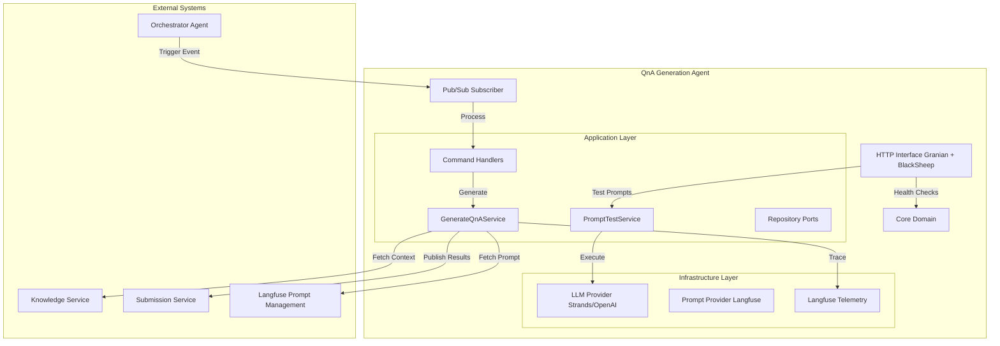
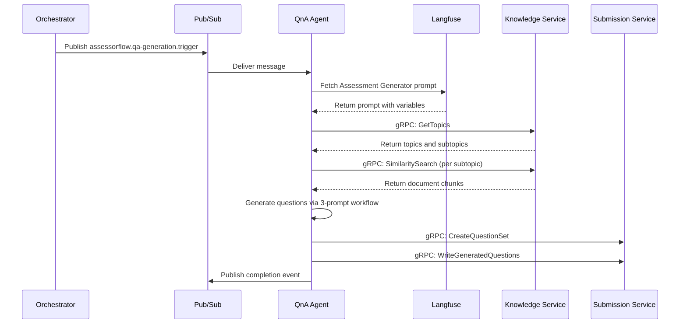

# QnA Generation Agent

[](https://www.python.org/downloads/)

A production-grade microservice for generating grounded questions and model answers as part of the AssessorFlow platform. This service integrates with Google Cloud Pub/Sub for event-driven workflows, gRPC for inter-service communication, and Langfuse for prompt management and telemetry. Persistence is handled via in-memory repositories (extensible to external stores).

## Architecture

### Overview



### Event Flow



### Tech Stack

| Component | Technology | Purpose |
|-----------|-----------|---------|
| Runtime | Python 3.13+ | Async-first Python with strict typing |
| HTTP Server | Granian + BlackSheep | High-performance ASGI server |
| Message Bus | Google Cloud Pub/Sub | Event-driven communication |
| Persistence | In-Memory | Question sets, idempotency (extensible) |
| LLM Integration | Strands Agents | Structured output generation |
| Prompt Management | Langfuse | Versioned prompt storage and retrieval |
| Telemetry | Langfuse | Distributed tracing and observability |
| gRPC | grpcio | Inter-service RPC |
| Serialization | orjson | Fast JSON handling |

## Project Structure

```
src/qna_generation_agent/
├── app/                    # Settings, bootstrap, JSON, logging, lifespan
│   ├── bootstrap.py        # DI container initialization
│   ├── lifespan.py         # Runtime state and health management
│   ├── logging.py          # Structured JSON logging
│   ├── json.py             # orjson wrappers
│   └── settings.py         # Environment configuration
├── application/            # Use cases, DTOs, ports, services
│   ├── commands.py         # Command handlers
│   ├── dto.py              # Data transfer objects
│   ├── services/           # GenerateQnAService, PromptTestService
│   └── ports/              # Repository interfaces
├── domain/                 # Entities, value objects, enums, events
│   ├── entities.py         # Question, Answer, QuestionSet
│   ├── enums.py            # QuestionType, DifficultyLevel
│   ├── events.py           # Domain events
│   ├── errors.py           # Domain errors
│   └── value_objects.py    # Type-safe IDs
├── infrastructure/         # External adapters
│   ├── llm/                # Strands provider, Langfuse prompt provider
│   ├── messaging/          # Pub/Sub publisher/subscriber
│   ├── persistence/        # In-memory repositories
│   ├── grpc/               # gRPC clients
│   └── telemetry/          # Langfuse tracing
└── interfaces/
    ├── http/               # HTTP server (health, prompt testing)
    └── serve/              # Unified HTTP + Pub/Sub process
```

## Installation

### Prerequisites

- Python 3.13 or higher
- Google Cloud project with Pub/Sub enabled (for production)
- Langfuse account (optional, for prompt management and telemetry)

### Setup

```bash
# Clone the repository
git clone <repo-url>
cd neo-qna-generation-agent

# Install dependencies using uv (recommended)
curl -LsSf https://astral.sh/uv/install.sh | sh
uv sync

# Or using pip
pip install -e ".[dev,test,lint]"
```

## Configuration

### Environment Variables

| Variable | Required | Default | Description |
|----------|----------|---------|-------------|
| `OPENAI_API_KEY` | Yes | - | OpenAI API key for LLM |
| `OPENAI_MODEL` | Yes | - | Model ID (e.g., `gpt-4o`) |
| `OPENAI_BASE_URL` | Yes | - | OpenAI API base URL |
| `OPENAI_TEMPERATURE` | No | `0.2` | LLM temperature |
| `OPENAI_MAX_OUTPUT_TOKENS` | No | `4096` | Max tokens per request |
| `SUBMISSION_SERVICE_URL` | Yes | - | gRPC URL for submission service |
| `KNOWLEDGE_SERVICE_URL` | Yes | - | gRPC URL for knowledge service |
| `GRPC_TIMEOUT_SECONDS` | No | `30.0` | gRPC call timeout |
| `GRPC_TLS_ENABLED` | No | `false` | Enable TLS for gRPC |
| `GRPC_TLS_CERT_PATH` | No | - | Path to TLS CA certificate |
| `HOST` | No | `0.0.0.0` | HTTP server host |
| `PORT` | No | `8000` | HTTP server port |
| `LOG_LEVEL` | No | `info` | Logging level |
| `PUBSUB_PROJECT_ID` | No | - | GCP project ID |
| `PUBSUB_SUBSCRIPTION_TRIGGER` | No | - | Pub/Sub subscription name |
| `PUBSUB_TOPIC_COMPLETE` | No | - | Pub/Sub topic for completion |
| `PUBSUB_TOPIC_DECISION_AUDIT` | No | - | Topic for decision audit events |
| `PUBSUB_TOPIC_TOKEN_USAGE` | No | - | Topic for token usage events |
| `PUBSUB_TOPIC_TRIGGER_DLQ` | No | - | Dead letter queue topic |
| `LANGFUSE_PUBLIC_KEY` | No | - | Langfuse public key |
| `LANGFUSE_SECRET_KEY` | No | - | Langfuse secret key |
| `LANGFUSE_BASE_URL` | No | `https://cloud.langfuse.com` | Langfuse host |
| `PROMPT_LABEL` | No | `production` | Default prompt label |
| `ENABLE_TEST_ROUTES` | No | `false` | Enable `/test/*` debug endpoints |
| `QA_GEN_MAX_ITERATIONS` | No | `3` | Max regeneration iterations |
| `QA_GEN_TIMEOUT_MS` | No | `30000` | Generation timeout (ms) |
| `LLM_TIMEOUT_SECONDS` | No | `120` | LLM call timeout |
| `CORS_ALLOWED_ORIGINS` | No | - | Comma-separated allowed origins |
| `CORS_ALLOW_CREDENTIALS` | No | `false` | Enable CORS credentials |

### Example .env File

```bash
# Required LLM configuration
OPENAI_API_KEY=sk-...
OPENAI_MODEL=gpt-4o
OPENAI_BASE_URL=https://api.openai.com

# Service dependencies
SUBMISSION_SERVICE_URL=grpc://localhost:50051
KNOWLEDGE_SERVICE_URL=grpc://localhost:50052

# Optional: Pub/Sub for event-driven mode
PUBSUB_PROJECT_ID=my-gcp-project
PUBSUB_SUBSCRIPTION_TRIGGER=qna-trigger-sub
PUBSUB_TOPIC_COMPLETE=qna-complete-topic

# Optional: Langfuse for prompts and telemetry
LANGFUSE_PUBLIC_KEY=pk-lf-...
LANGFUSE_SECRET_KEY=sk-lf-...
LANGFUSE_BASE_URL=https://cloud.langfuse.com

# Security settings
CORS_ALLOWED_ORIGINS=https://app.example.com
GRPC_TLS_ENABLED=true
```

## Usage

### Running the Server

The service runs as a unified HTTP + Pub/Sub process:

```bash
uv run qna-serve
```

This single process handles both HTTP health checks and Pub/Sub message consumption, ensuring proper lifecycle management and graceful shutdown.

> **Note:** Workers are hardcoded to 1 (enforced in `settings.py` via `ge=1, le=1`). This is intentional — the service uses a unified single-process model where HTTP and Pub/Sub share the same event loop. This prevents concurrency issues with Strands workflow state and in-memory repositories. For scaling, use horizontal pod autoscaling (multiple replicas) rather than increasing workers per pod.

**Graceful Shutdown:** The server responds to SIGTERM and SIGINT signals with a 10-second timeout for in-flight message processing.

### Health Check Endpoints

| Endpoint | Description |
|----------|-------------|
| `GET /healthz` | Basic health check |
| `GET /livez` | Kubernetes liveness probe |
| `GET /readyz` | Readiness probe with dependency checks (Pub/Sub, LLM, Prompt Provider, gRPC services) |
| `GET /version` | Application version and environment |
| `GET /docs` | Swagger UI documentation |

### API Examples

```bash
# Health check
curl http://localhost:8000/healthz

# Readiness check (includes Pub/Sub, LLM, Prompt Provider status)
curl http://localhost:8000/readyz

# Version info
curl http://localhost:8000/version
```

Response example:

```json
{
  "version": "0.1.0",
  "environment": "local"
}
```

### Prompt Testing Endpoints (Development)

When `ENABLE_TEST_ROUTES=true` AND Langfuse is configured, three endpoints are available for testing individual Langfuse prompts via direct Strands Agent execution:

| Endpoint | Method | Description | Default Values |
|----------|--------|-------------|----------------|
| `/test/prompt/assessment` | `POST` | Test Assessment Generator | `structured_count=2`, `non_structured_count=1`, `difficulty=medium`, `topics="Grammar, Vocabulary, Article Usage"` |
| `/test/prompt/mcq-answer` | `POST` | Test MCQ Answer Generator | `question_stem="The student ____ to school yesterday..."`, `grammar_target="past continuous tense"`, `l1_background="Chinese"` |
| `/test/prompt/mcq-explanation` | `POST` | Test MCQ Explanation Generator | `question="Choose the correct article..."`, `options={A,B,C,D}`, `correct_answer="A"` |

These endpoints return:
- `success`: Whether execution succeeded
- `prompt_version`: Which Langfuse prompt version was used
- `execution_time_ms`: Duration of the workflow execution
- `result`: Parsed structured output from the LLM
- `error`: Error message (if failed)

**Example:**

```bash
# Test Assessment Generator with defaults
curl -X POST http://localhost:8000/test/prompt/assessment \
  -H "Content-Type: application/json" \
  -d '{}'

# Test with custom values
curl -X POST http://localhost:8000/test/prompt/assessment \
  -H "Content-Type: application/json" \
  -d '{
    "structured_count": 5,
    "non_structured_count": 2,
    "difficulty": "hard",
    "topics": "Academic Writing",
    "chunks": ["Your custom document chunk here..."]
  }'
```

**Requirements:**
- `ENABLE_TEST_ROUTES=true` must be set
- Langfuse must be configured (`LANGFUSE_PUBLIC_KEY`, `LANGFUSE_SECRET_KEY`)
- Returns 503 if test routes are disabled or Langfuse is not available
- Returns 500 if prompt execution fails

## Prompt Management

The service integrates with Langfuse for centralized prompt management. Prompts are fetched on-demand (with 5-minute SDK caching) ensuring updates take effect without service restart.

### Available Prompts

| Prompt Name | Purpose | Variables |
|-------------|---------|-----------|
| `Assessment Generator` | Generate ELP assessment questions for Singapore foreign students | `{structured_count}`, `{non_structured_count}`, `{difficulty}`, `{topics}`, `{chunks}` |
| `MCQ Explanation Generator` | Generate detailed explanations for MCQ distractors with L1 interference notes | `{question}`, `{options}`, `{correct_answer}`, `{target_audience}` |
| `MCQ Answer Generator` | Generate MCQ answers with L1-targeted distractors | `{question_stem}`, `{grammar_target}`, `{difficulty}`, `{l1_background}` |

## LLM Generation Workflow

The service uses a **sequential 3-prompt workflow** for structured question generation:

```mermaid
flowchart TB
    subgraph "3-Prompt Sequential Workflow"
        Start[Input: Context + Count + Difficulty]

        Step1[Step 1: Assessment Generator]
        Step1Output[Output: QuestionStems]

        Step2[Step 2: MCQ Answer Generator]
        Step2Output[Output: MCQAnswers with Distractors]

        Step3[Step 3: MCQ Explanation Generator]
        Step3Output[Output: Detailed Explanations]

        End[Final: Complete Questions]
    end

    Start --> Step1
    Step1 --> Step1Output
    Step1Output --> Step2
    Step2 --> Step2Output
    Step2Output --> Step3
    Step3 --> Step3Output
    Step3Output --> End
```



### Workflow Steps

| Step | Prompt | Purpose | Output |
|------|--------|---------|--------|
| **1** | Assessment Generator | Generate question stems from source chunks | `QuestionStem[]` |
| **2** | MCQ Answer Generator | Generate MCQ answers with L1-targeted distractors | `MCQAnswer[]` |
| **3** | MCQ Explanation Generator | Generate detailed explanations with CEFR analysis | `MCQExplanation[]` |

**Note:** The previous Workflow Provider (using Strands workflow tool) was removed due to production-safety issues including timing-dependent parsing, broken ID aggregation, and brittle exception handling. The sequential workflow is more predictable, debuggable, and reliable.

### Using Prompts in Code

```python
from qna_generation_agent.infrastructure.llm.langfuse_prompt_provider import (
    LangfusePromptProvider,
)
from qna_generation_agent.infrastructure.llm.prompt_builder import (
    AssessmentGeneratorInputSchema,
    AssessmentGeneratorOutputSchema,
)

# Fetch prompt from Langfuse
provider = LangfusePromptProvider(...)
prompt = await provider.get_assessment_generator_prompt(label="production")

# Compile with validated inputs
input_data = AssessmentGeneratorInputSchema(
    structured_count=5,
    non_structured_count=3,
    difficulty="medium",
    topics="Grammar, Vocabulary",
    chunks="[Chunk 1] ...",
)
compiled_prompt = prompt.compile(**input_data.model_dump())

# Use with Strands for structured output
result = await llm_provider.invoke_with_schema(
    compiled_prompt,
    structured_output_model=AssessmentGeneratorOutputSchema,
)
```

### Creating Prompts in Langfuse

```python
from langfuse import Langfuse

langfuse = Langfuse()

# Create Assessment Generator prompt
langfuse.create_prompt(
    name="Assessment Generator",
    type="text",
    prompt="""Generate EXACTLY {structured_count} MCQ questions...

Respond in JSON format:
{{
    "questions": [...]
}}""",
    labels=["production"],
)
```

## Development

### Code Quality

```bash
# Run all quality checks
uv run ruff check .
uv run ruff check . --fix
uv run mypy .

# Run tests
uv run pytest
uv run pytest -m unit
uv run pytest -m integration

# Run with coverage
uv run pytest --cov=qna_generation_agent --cov-report=html
```

### Code Standards

- **Line length:** 88 characters (Black-compatible)
- **Type checking:** Strict mypy with `disallow_untyped_defs`
- **Linting:** Ruff with E, F, W, I, UP, B, C4, ASYNC, RUF rules
- **Logging:** Structured JSON via structlog
- **Testing:** pytest with 80% coverage minimum

## Security Considerations

### CORS Configuration

By default, CORS is unrestricted in development. For production:

```bash
CORS_ALLOWED_ORIGINS=https://app.example.com,https://admin.example.com
CORS_ALLOW_CREDENTIALS=true
```

- Wildcard (`*`) origins are blocked when credentials are enabled
- Empty configuration allows all origins (development mode only)

### gRPC TLS

Enable TLS for production gRPC connections:

```bash
GRPC_TLS_ENABLED=true
GRPC_TLS_CERT_PATH=/path/to/ca-cert.pem  # Optional: custom CA
```

### Input Validation

- All domain entities validate inputs in `__post_init__`
- API schemas use Pydantic for runtime validation
- Pub/Sub messages are validated against `TriggerEnvelope` schema

### Secrets Management

- Never commit `.env` files
- Use secret management in production (Google Secret Manager, etc.)
- API keys are validated at startup; missing keys raise `ConfigurationError`

## Deployment

### Container

See `deployments/container/Containerfile` for the production multi-stage build:

```dockerfile
FROM rockylinux/rockylinux:10-ubi AS builder

ENV UV_CACHE_DIR=/tmp/uv-cache \
    UV_LINK_MODE=copy \
    UV_COMPILE_BYTECODE=1 \
    UV_PROJECT_ENVIRONMENT=/opt/app/.venv

WORKDIR /workspace

COPY --from=ghcr.io/astral-sh/uv:0.8.15 /uv /usr/local/bin/uv
COPY pyproject.toml uv.lock README.md ./
COPY src ./src

RUN uv sync --frozen --no-dev --no-editable --active

FROM rockylinux/rockylinux:10-ubi

ENV VIRTUAL_ENV=/opt/app/.venv \
    PATH=/opt/app/.venv/bin:$PATH \
    PYTHONPATH=/opt/app/src

COPY --from=builder /opt/app/.venv /opt/app/.venv
COPY --from=builder /workspace/src /opt/app/src

RUN groupadd -g 10001 appgroup && \
    useradd -u 10001 -g appgroup -s /sbin/nologin appuser
USER 10001:10001

EXPOSE 8080

ENTRYPOINT ["/opt/app/.venv/bin/python", "-m", "granian"]
CMD ["--interface", "asgi", "--host", "0.0.0.0", "--port", "8080", "qna_generation_agent.interfaces.serve.app:app"]
```

### Kubernetes

```yaml
apiVersion: apps/v1
kind: Deployment
metadata:
  name: neo-qna-generation-agent
spec:
  replicas: 3
  selector:
    matchLabels:
      app: neo-qna-generation-agent
  template:
    metadata:
      labels:
        app: neo-qna-generation-agent
    spec:
      containers:
        - name: app
          image: neo-qna-generation-agent:latest
          ports:
            - containerPort: 8080
          envFrom:
            - secretRef:
                name: qna-secrets
            - configMapRef:
                name: qna-config
          livenessProbe:
            httpGet:
              path: /livez
              port: 8080
          readinessProbe:
            httpGet:
              path: /readyz
              port: 8080
          lifecycle:
            preStop:
              exec:
                command: ["/bin/sh", "-c", "sleep 15"]
```

**Important:** The service is designed to run with a single worker per pod (`workers=1`). Do not override this — the unified process model requires single-threaded operation. Scale horizontally via replicas, not vertical workers.

**Note:** The `preStop` hook gives the service 15 seconds to gracefully shutdown before Kubernetes sends SIGKILL.

### Horizontal Pod Autoscaling

```yaml
apiVersion: autoscaling/v2
kind: HorizontalPodAutoscaler
metadata:
  name: neo-qna-generation-agent
spec:
  scaleTargetRef:
    apiVersion: apps/v1
    kind: Deployment
    name: neo-qna-generation-agent
  minReplicas: 2
  maxReplicas: 10
  metrics:
    - type: Resource
      resource:
        name: cpu
        target:
          type: Utilization
          averageUtilization: 70
```

## Troubleshooting

### Common Issues

#### Pub/Sub Authentication Errors

```
Error: Failed to authenticate with Pub/Sub
```

**Solution:**
- Ensure GCP credentials are configured
- Check service account permissions
- Verify `PUBSUB_PROJECT_ID` is correct

#### LLM Rate Limiting

```
Error: Rate limit exceeded
```

**Solution:**
- Implement exponential backoff in caller
- Consider request batching
- Monitor rate limits in Langfuse traces

#### Prompt Provider Not Available

```
readyz check fails: prompt_provider_healthy: false
```

**Solution:**
- Verify `LANGFUSE_PUBLIC_KEY` and `LANGFUSE_SECRET_KEY` are set
- Check Langfuse host connectivity
- Ensure prompts exist in Langfuse project

#### Service Won't Shut Down

```
Process hangs on SIGTERM
```

**Solution:**
- The service has `respawn_failed_workers=False` configured
- Check for long-running message processing in logs
- Pub/Sub subscriber has a 10-second timeout for in-flight messages

### Logging

Structured JSON logs are emitted to stdout. Key log fields:

- `event`: Log event type
- `level`: Log level
- `timestamp`: ISO 8601 timestamp
- `request_id`: Correlation ID for tracing
- `error`: Error details (when applicable)

Example query in Cloud Logging:

```
jsonPayload.event="message_processed"
resource.labels.container_name="neo-qna-generation-agent"
```

## Contributing

1. Fork the repository
2. Create a feature branch: `git checkout -b feature/my-feature`
3. Make changes with tests
4. Run quality checks: `uv run ruff check . && uv run mypy .`
5. Commit with clear messages
6. Push and create a PR

### Development Setup

```bash
# Install pre-commit hooks
uv run pre-commit install

# Run all checks before committing
uv run ruff check . && uv run mypy . && uv run pytest
```

## Related Documentation

- [CLAUDE.md](CLAUDE.md) - Architecture and development guide
- [API Documentation](http://localhost:8000/docs) - Swagger UI (when running)
- [Langfuse Documentation](https://langfuse.com/docs) - Prompt management and telemetry
